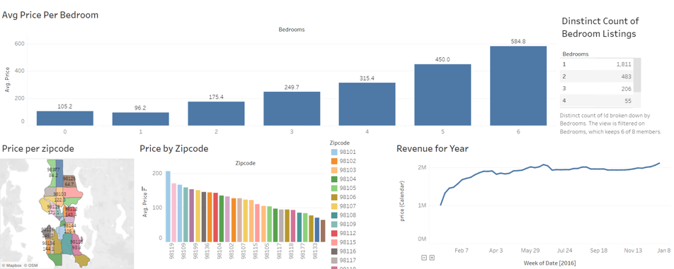

# Tableau Dashboard - Airbnb Rent Data Visualization

## Overview
This Tableau dashboard provides an interactive visualization of Airbnb rent data, allowing users to explore various aspects such as the average price by bedroom, average price by zip code with geographic data, and the revenue for the year 2016. It offers a comprehensive view of the Airbnb rental market, enabling users to gain insights and make data-driven decisions.

## Result

||
| :--: |
| *Dashboard* |

This is the link of the project published on Tableau Public: [AirBnB](https://public.tableau.com/app/profile/ha.nguyen7783/viz/AirBnBFullProject_16878601190560/Dashboard1)

This dashboard shows the Average Price Per Bedroom, number of bedrooms, price per bedroom, and Revenue for 2016.

## Method

### Cleaning data

Look through the data and select  useful values to make the chart.

## Create Dashboard

1. **Load Data:** Open the Tableau application and import the Airbnb rent data into the software.
2. **Connect Data:** Connect the imported data to the dashboard by creating appropriate data source connections. we connect 3 sheets ( Listings, Reviews, Calendar) by Joins.
3. **Interact with the Dashboard:** Once the data is connected, the dashboard will become interactive. Explore the different features, including the average price by bedroom, average price by zip code with Geo data, and revenue for 2016.

* Average Price by Bedroom: This feature provides a visual representation of the average price of Airbnb rentals based on the number of bedrooms. It allows users to understand the price distribution and identify any patterns or trends.

* Average Price by Zip Code with Geo Data: This feature utilizes geographic data to map the average price of Airbnb rentals across different zip codes. Users can explore the map to identify areas with higher or lower rental prices.

* Revenue for 2016: This feature showcases the total revenue generated from Airbnb rentals for the year 2016. Users can gain insights into the consult house prices in the year.

4. **Export and Share:** We will share the dashboard with others by publishing it to Tableau Public.

## Credits

This original Tableau dashboard was created by Alex The Analyst. The Airbnb rent data used in this visualization was sourced from Kaggle.com, and any additional data or references used are mentioned within the dashboard.

